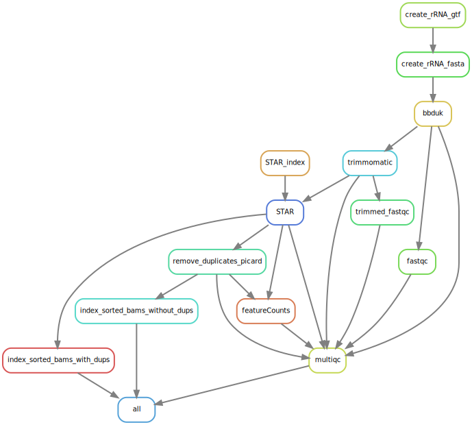

# RAW-ABS - RNAseq Analysis Workflow, Alignment BaSed 
# Alignment based workflow for Illumina Short reads

This workflow is a quick and easy solution for performing RNA-seq data quality checking and handling before downstream analyses (e.g. Differential Expression analysis) in R, etc.  
Using the conda environment it is ready to use very quickly and probably requires only few modifications for most use-cases.  
Future updates will likely include installation of software during run-time.  
Downstream analyses are not included since RAW-ABS purpose is to fit a broad range of scenarios (different software) that might come later and can make use of the featureCounts produced count matrixes on gene and transcript level.  
The second major output is a multiQC html report aggregating fastqc, trimmomatic, picard, STAR and featureCounts stats.  
  
If you use RAW-ABS in your analysis:  
1.) awesome! I am glad you found it useful  
2.) be a darling and please cite the repository ;D  

# Setup:
Install the Python 3 version of Miniconda.
you can get it here: https://docs.conda.io/en/latest/miniconda.html

Answer yes to the question whether conda shall be put into your PATH.
For detailed options concerning conda/bioconda see:

Then, you can install Snakemake with

`conda install -c bioconda -c conda-forge snakemake`

Preparing a working directory
First, create a new directory and change into that directory in your terminal.

Download/Clone the current release of the RAW-ABS workflow into the directory.

The included environment.yaml file can be used to install all required software into an isolated Conda environment with a name of your choice - in the following we will call it "RAW-ABS":

`conda env create --name RAW-ABS --file environment.yaml`

Activating the environment
To activate the snakemake-tutorial environment, execute

`conda activate RAW-ABS`

Now you can use the installed tools and our workflow without any software dependency issues.
For detailed options of snakemake see: https://snakemake.readthedocs.io/en/v5.5.1/executable.html

Should you want to remove the conda environment, execute
`conda env remove -n RAW-ABS`

# Usage:
1) Move, copy or link fasta and gtf of your species into the FGS directory
2) Move, copy or link your gzipped fastq files to the rawreads directory
3) All options of the workflow can easily be controlled via the config.yaml file
  - rename your fastq files to follow the naming scheme: xxxx_1.fq.gz for PE reads!
4) Check whether or not your annotation includes rRNA entries - if not exclude the bbduk rules from the workflow and also change the paths of the fastqc and trimmomatic inputs to use the rawreads!  
5) When all this is done execute `snakemake -np` to check if the workflow works and perform a dry-run  
6) To start the workflow execute `snakemake --cores xx` and set the total amount of threads to be used  

# What it does:
- Removal of rRNA reads via bbduk
- FastQC on rRNA depleted RawReads
- Trimming and FastQC on these trimmed Reads
- alignment/mapping via STAR (including index) - outputs directly to sorted bam
- duplicate removal via Picard MarkDuplicates
- featureCounts on alignment files (with/without multimappers)
- multiqc report of all steps
- all indexes for visualization software

`snakemake --rulegraph | dot -Tsvg > rulegraph.svg`

